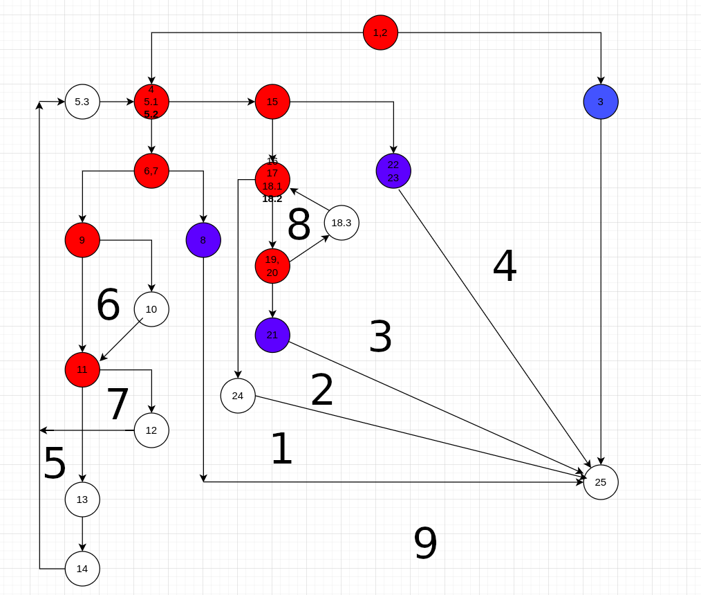
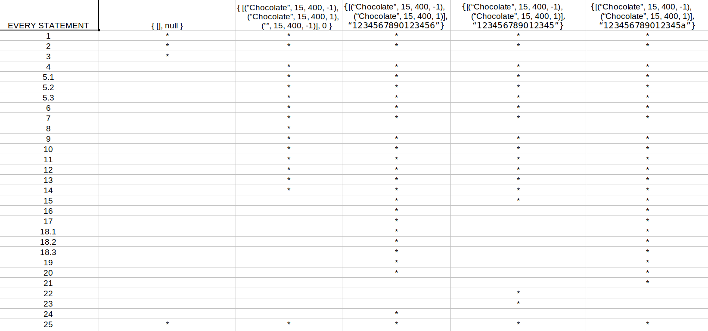

# Стефан Секулов, бр. на индекс 235009

# Control Flow Graph

# Цикломатска комплексност
Барање 3: Цикломатската комплексност е 9 и ја добив со броење на регионите во контролниот граф.

# Тест случаи според критериумот Every statement
Потребни се вкупно 5 тест случаи:  
1. Во првиот тест случај испраќаме празна листа од објекти ;  
2. Во вториот тест случај во листата испраќаме објект со атрибут name којшто е празен String и со тоа фрла Exception ;  
3. Во третиот тест случај нема фрлање на Exception и со тоа достигнуваме “return sum“ ;  
4. Во четвртиот тест случај испраќаме cardNumber чиј length е 15 и со тоа фрла Exception ;  
5. Во петтиот тест случај во Stringot cardNumber испраќаме буква и со тоа фрла Exception ;  

# Тест случаи според критериумот Multiple Condition  
**if (item.getPrice() > 300 || item.getDiscount() > 0 || item.getQuantity() > 10)**  
1. (T || X || X) - Доколку првиот услов се исполнува, нема потреба наредните два да се гледаат  
2. (F || T || X) - Доколку првиот услов не се исполнува а вториот се исполнува, нема потреба да се гледа третиот услов  
3. (F || F || T) - Доколку првиот и вториот услов не се исполнуваат, тогаш третиот мора да биде исполнет
4. (F || F || F) - Доколку никој услов не се исполнува  

# Објаснување на напишаните unit tests  
**void testEveryStatement():**
1. Првиот тест случај очекува exception со порака: allItems list can't be null!
2. Вториот тест случај очекува exception со порака: Invalid item!
3. Третиот тест случај очекува return на променливата sum и таа променлива изнесува 5940
4. Четвртиот тест случај очекува exception со порака: Invalid card number!!
5. Петтиот тест случај очекува exception со порака: Invalid character in card number!

**void multiplecondition():**  
Во сите тест случаеви очекуваме return на променливата sum: -30, -30, 3259, 2691 соодветно за секој тест случај.